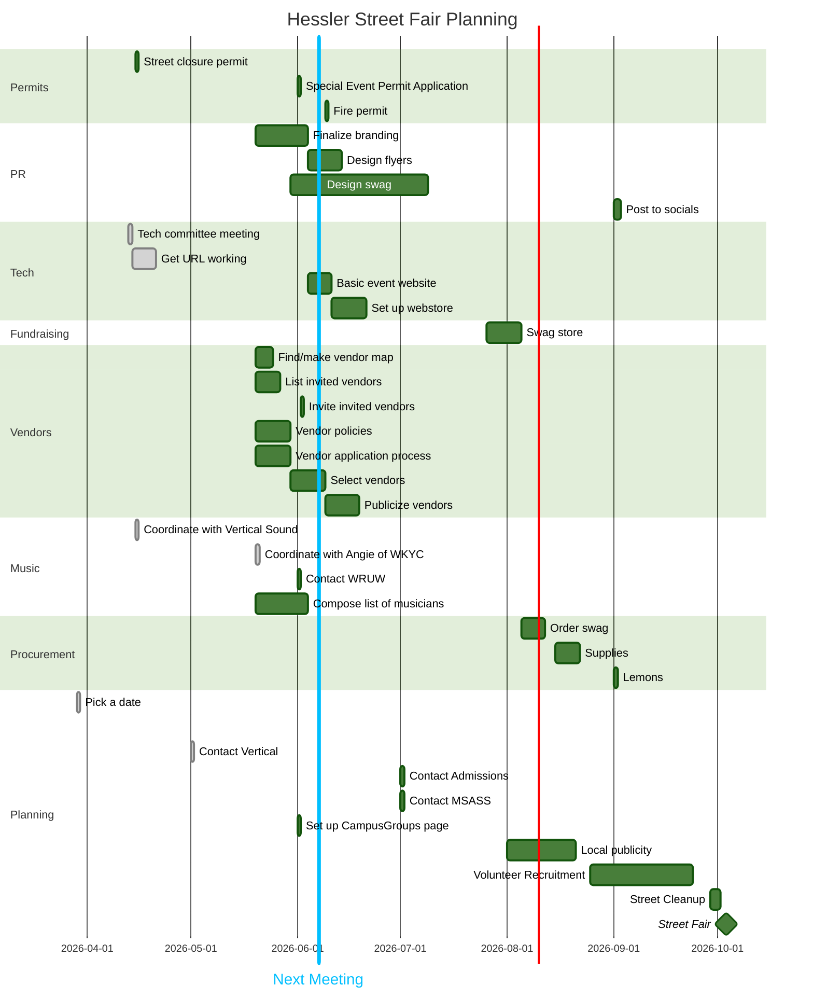
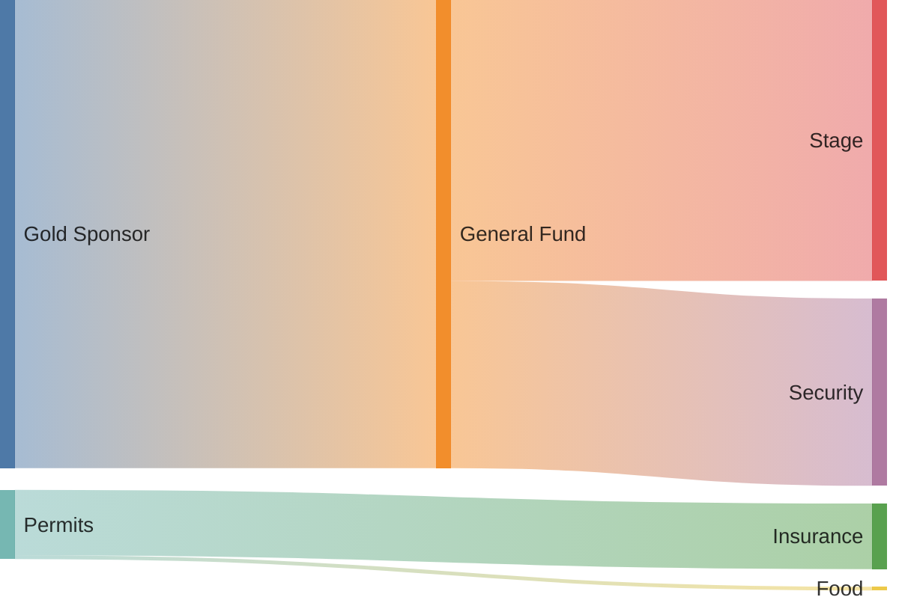

```mermaid
%%{init: {'theme': 'forest'}}%%
gantt
    title  Hessler Street Fair Planning
    dateFormat YYYY-MM-DD
    section Permits
            Street closure permit    :streetpermit, 2026-04-15, 1d
            Special Event Permit Application    :eventpermit, 2026-06-01, 1d
            Fire permit    :firepermit, after vendorselect eventpermit, 1d

    section PR
            Finalize branding : brand, 2026-05-20, 15d
            Design flyers : flyers, after brand, 10d
            Design swag    : designswag, 2026-05-30, 40d
            Post to socials: socials, 2026-09-01, 2d
    section Tech
            Tech committee meeting: done, techmeet, 2026-04-13, 1d
            Get URL working:done, url, after techmeet, 7d
            Basic event website: basicsite, after brand, 7d
            Set up webstore: webstore, after basicsite, 10d
    section Fundraising
            Swag store    :swagstore, after designswag webstore swag, 10d
    section Vendors
            Find/make vendor map: vendormap, 2026-05-20, 5d
            List invited vendors: invitelist, 2026-05-20, 7d
            Invite invited vendors: invite, after invitelist eventpermit, 1d
            Vendor policies: policy, 2026-05-20, 10d
            Vendor application process: vendorapp, 2026-05-20, 10d
            Select vendors: vendorselect, after invitelist vendorapp, 10d
            Publicize vendors: vendor-announce, after vendorselect, 10d
    section Music
            Coordinate with Vertical Sound    :done, vertical, 2026-04-15, 1d
            Coordinate with Angie of WKYC    : done, wkyc, 2026-05-20, 1d
            Contact WRUW: wruw, 2026-06-01, 1d
            Compose list of musicians: musiclist, 2026-05-20, 15d
    section Procurement
            Order swag:   swag, after swagstore, 7d
            Supplies: supplies, 2026-08-15, 7d
            Lemons: lemons, 2026-09-01, 1d
    section Planning
            Pick a date :done, pick, 2026-03-29, 1d
            Next Meeting :vert, v1, 2026-06-07, 0d
            Contact Vertical: done, vertical, 2026-05-01, 1d
            Contact Admissions: admissions, 2026-07-01, 1d
            Contact MSASS: msass, 2026-07-01, 1d
            Set up CampusGroups page: campusgroups, 2026-06-01, 1d
            Local publicity: publicize, 2026-08-01, 20d
            Volunteer Recruitment: recruit, 2026-08-25, 30d
            Street Cleanup: cleanup, 2026-09-29, 3d
            Street Fair        :milestone, streetfair, 2026-10-03, 1d

```

```mermaid
---
config:
  sankey:
    showValues: false
---
sankey-beta


Gold Sponsor, General Fund, 5000
General Fund, Stage, 3000
Permits, Insurance, 700
Permits, Food, 40
General Fund, Security, 2000
```
